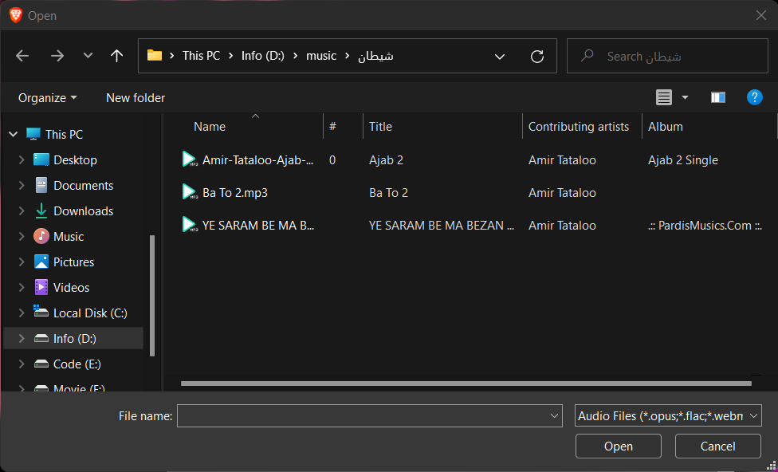
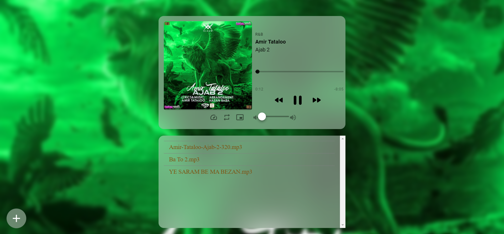
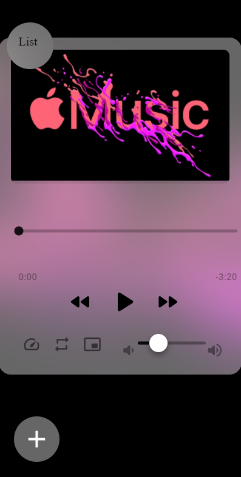

# Music Player


***The latest music player you need!***


## Installation

Use the package manager [npm](https://www.npmjs.com/) to install music player.


1
```bash
npm i
```


2
```bash
npm start
```


## Usage

- Sign in/up
  - 


- Click to file explore icon
  - 


- Select music files
  - 


#### Now playing you selected music



## Play List
You can click the play list items for play music


## Features

#### Browser meta data


#### Loop


#### Faster


#### Browser Picture-In-Picture


## Responsive Design



## Contributing
Pull requests are welcome. For major changes, please open an issue first to discuss what you would like to change.

Please make sure to update tests as appropriate.
