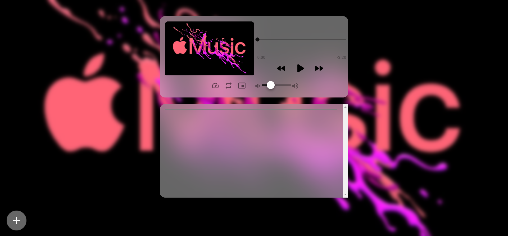
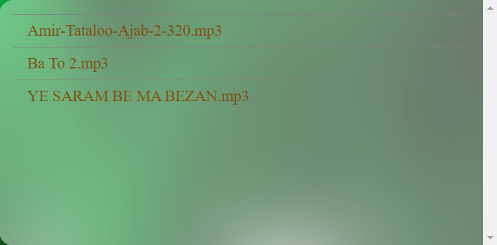
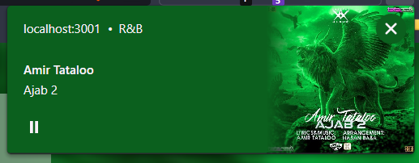
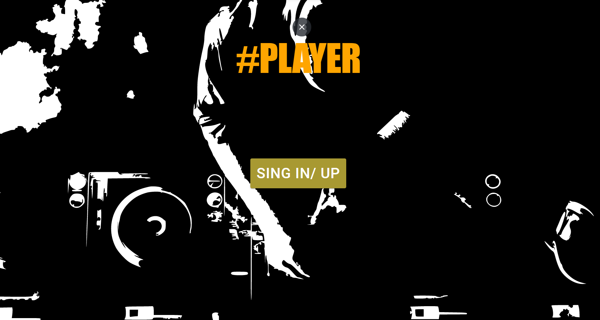

# Music Player


***The latest music player you need!***





## Installation

Use the package manager [npm](https://www.npmjs.com/) to install music player.


```bash
npm i && npm start
```


## Play List
You can click the play list items for play music



## Features

#### Browser meta data



#### Browser Picture-In-Picture


#### Sign in/up



[Supported audio coding formats](https://en.wikipedia.org/wiki/HTML5_audio)


## Contributing
Pull requests are welcome. For major changes, please open an issue first to discuss what you would like to change.

Please make sure to update tests as appropriate.
